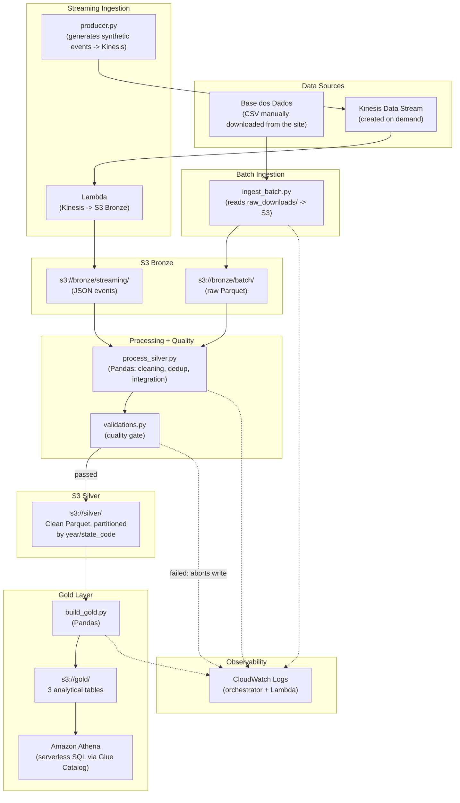

# Tech Challenge Phase 2 — Hybrid Pipeline for Literacy Analysis in Brazil

This folder is **Phase 2** (data engineering). The supervised model lives in [`../fase3`](../fase3/README.md).

A **Batch + Streaming** data pipeline, 100% AWS, with a **Medallion Architecture** (Bronze / Silver / Gold) to integrate and analyze the **Child Literacy Indicator** ("Indicador Criança Alfabetizada"), using Pandas, Amazon Kinesis (on demand), and custom data-quality validations.

> Capstone project for the Data Engineering course (POSTECH/FIAP) — combines Big Data Architecture, ETL Pipelines, Relational Databases and NoSQL for Data Science.

---

## Summary

1. [Problem Context](#1-problem-context)
2. [The Technical Challenge](#2-the-technical-challenge)
3. [Solution Architecture](#3-solution-architecture)
4. [Data Flow](#4-data-flow)
5. [Pipeline Layers (Medallion)](#5-pipeline-layers-medallion)
6. [Data Quality](#6-data-quality)
7. [On-Demand Streaming (Kinesis)](#7-on-demand-streaming-kinesis)
8. [Technologies Used](#8-technologies-used)
9. [Architectural Decisions (Trade-offs)](#9-architectural-decisions-trade-offs)
10. [Monitoring and Observability](#10-monitoring-and-observability)
11. [FinOps — Cost Optimization](#11-finops--cost-optimization)
12. [AI Applications](#12-ai-applications)
13. [Repository Structure](#13-repository-structure)
14. [Step-by-Step AWS Setup](#14-step-by-step-aws-setup)
15. [Testing Locally without AWS (`--dry-run`)](#15-testing-locally-without-aws---dry-run)
16. [References](#16-references)

Phase 3 (supervised model on Silver): [`../fase3/README.md`](../fase3/README.md).

---

## 1. Problem Context

Childhood literacy is one of the fundamental pillars of a country's educational, social, and economic development. In this context, the **National Commitment to Literate Children** ("Compromisso Nacional Criança Alfabetizada") is a Brazilian public policy that mobilizes the federal government, states, the Federal District, and municipalities with the goal of ensuring every Brazilian child is literate by the end of the 2nd grade of elementary school.

To support the definition of national parameters, **INEP (Brazil's National Institute for Educational Studies and Research)** conducted, in 2023, the *Alfabetiza Brasil Survey*, defining a cutoff of **743 points** on the SAEB proficiency scale — the level above which a child is considered literate. Based on this parameter, the **Child Literacy Indicator** was created, expressing the percentage of students who reach that threshold. The national target is for all Brazilian children to be literate by the end of the 2nd grade of elementary school by **2030**.

Understanding the factors that influence literacy requires integrating different data sources — national, state, and municipal targets, territorial data, and performance indicators — to enable analyses of educational inequality and support evidence-based public policy.

This project acts as the data engineering team of a public educational-analytics organization, building a **hybrid (Batch + Streaming) pipeline** that integrates these sources while guaranteeing quality, scalability, and cloud cost efficiency.

### Data source

All data comes from the [Base dos Dados](https://basedosdados.org) platform, from the following entities:

| Entity | Description |
|---|---|
| `sigla_uf` | State (UF) directory |
| `municipios` | Municipality directory (IBGE code, state, region) |
| `metas_nacionais` | Brazil's national literacy target (National Commitment) |
| `metas_uf` | Literacy target per state |
| `metas_municipio` | Literacy target per municipality |
| `indicador_crianca_alfabetizada` | Performance indicator per municipality/year (INEP) |

---

## 2. The Technical Challenge

Build a scalable cloud data pipeline that performs:

- Ingestion of different educational data sources (batch + streaming);
- Cleaning and standardization of the data;
- Integration across heterogeneous datasets;
- A reliable analytical layer (Gold) made available for consumption;
- Operational monitoring of the pipeline;
- Infrastructure cost control (FinOps).

---

## 3. Solution Architecture

A **100% AWS** architecture, following the **Medallion** pattern (Bronze → Silver → Gold), with two ingestion paths that converge at the Silver layer:



### AWS services used

| Service | Role in the architecture |
|---|---|
| **Amazon S3** | Data Lake — the 3 layers (Bronze/Silver/Gold) and quality reports, in Parquet |
| **Amazon Kinesis Data Streams** | Streaming simulation (equivalent to the Kafka taught in the course), created/destroyed on demand |
| **AWS Lambda** | Serverless consumer of the Kinesis stream → writes to S3 Bronze |
| **AWS Glue Data Catalog** | Metastore for the Parquet tables in S3 (populated via manual DDL, no Crawler) |
| **Amazon Athena** | Serverless SQL query engine over the Gold layer |
| **Amazon CloudWatch** | Logs and monitoring for the whole pipeline (orchestrator, Lambda) |
| **AWS IAM** | Execution roles/policies for the Lambda with least-privilege permissions |

> **Ingestion without GCP:** although the data is published by Base dos Dados (which originally uses BigQuery/GCP as its query engine), all the required tables have fewer than 200,000 rows — which allows for **direct CSV download** from each table's web page, without needing a Google Cloud account or a `billing_project_id`. The files are downloaded once into `raw_downloads/`, and the rest of the pipeline runs entirely on AWS.

---

## 4. Data Flow

```
Base dos Dados (CSV) ──batch──► S3 Bronze ──► process_silver.py ──► validations.py ──► S3 Silver ──► build_gold.py ──► S3 Gold ──► Athena
Kinesis (on demand) ──stream──► Lambda ──► S3 Bronze ──────────────────────────────────────────────────────────────────────────────────►
```

1. **Batch**: `ingest_batch.py` reads the 6 CSVs from `raw_downloads/`, standardizes the column names (snake_case), and writes each table as Parquet to `s3://<bronze>/batch/<table>/`.
2. **Streaming**: `producer.py` generates synthetic events for new measurements and publishes them to Kinesis; `lambda_consumer.py` consumes the stream and writes the raw events as JSON Lines to `s3://<bronze>/streaming/dt=<date>/`.
3. **Silver**: `process_silver.py` reads batch + streaming from Bronze, cleans, deduplicates, normalizes keys, and **integrates the 6 entities** into a single table keyed by `municipality_id + year`.
4. **Quality**: before writing, `quality/validations.py` runs 5 business checks. If any fails, Silver **is not written** and the pipeline stops.
5. **Gold**: `build_gold.py` reads Silver and creates the 3 analytical tables, written as Parquet to `s3://<gold>/`.
6. **Consumption**: `infrastructure/athena_ddl.sql` registers the 3 Gold tables in the Glue Catalog; any analyst can query them via SQL in Amazon Athena.

The two paths (batch and streaming) **converge at Silver**, ensuring that both the official INEP history and recent simulated events feed the same analytical layer.

---

## 5. Pipeline Layers (Medallion)

### 🥉 Bronze — Raw Data

- `s3://<bronze>/batch/<table>/<table>.parquet` — each of the 6 source tables, **exactly as it came from the CSV** (same values, only the column names standardized), with no content transformation. Preserves the full history — if anything goes wrong in the following layers, it's always possible to reprocess from here.
- `s3://<bronze>/streaming/dt=<YYYY-MM-DD>/*.json` — raw Kinesis events, written as JSON Lines by the Lambda, following the same no-transformation philosophy.

Script: [`pipelines/batch/ingest_batch.py`](pipelines/batch/ingest_batch.py)

### 🥈 Silver — Cleaned and Integrated Data

Script: [`pipelines/batch/process_silver.py`](pipelines/batch/process_silver.py) (Pandas)

- Selects the **Municipal** network as the representative row for the indicator per municipality/year (stable coverage across the available years and the one most aligned with the national target — see the `MUNICIPAL_NETWORK` comment in the code for the full analysis);
- Merges the batch indicator + streaming events and **deduplicates** by `municipality_id + year`, prioritizing the batch data (official history) over streaming (synthetic);
- Handles nulls in critical fields (drops them, logging the count and the reason);
- Standardizes column names (`snake_case`) and normalizes keys: `municipality_id` zero-padded to 7 digits (IBGE), `state_code` upper-cased;
- Applies sanity filters: `literacy_rate` between 0–100, `state_code` in the 27 valid states, `municipality_id` present in the municipalities table;
- **Integrates the 6 entities** (states, municipalities, national/state/municipality targets, indicator) into a wide table by municipality/year;
- Runs the **formal quality gate** (`quality/validations.py`) — if it fails, Silver is not written;
- Writes to `s3://<silver>/literacy_indicator/year=<year>/state_code=<uf>/*.parquet` (Hive layout, natively recognized by Glue/Athena).

### 🥇 Gold — Analytical Layer

Script: [`pipelines/batch/build_gold.py`](pipelines/batch/build_gold.py) (Pandas), creates 3 tables:

| Table | Description | Partitioning |
|---|---|---|
| `municipality_indicator` | % of literate students by municipality and year, with location attributes and the proficiency-level distribution | `year/state_code` |
| `target_vs_result` | Compares the actual result with the same year's target at 3 levels (municipality, state, national), computing the **gap** (result − target) at each one | `year/state_code` |
| `time_evolution` | Aggregated historical series of the indicator (national and by state): municipalities assessed, average rate, target, and gap per year | single file (small, already-aggregated table) |

Registered in the **Glue Catalog** via manual `CREATE EXTERNAL TABLE` (`infrastructure/athena_ddl.sql`), using **partition projection** — Athena computes the existing partitions from the path pattern (`year=<year>/state_code=<uf>/`), without needing `MSCK REPAIR TABLE` or a Glue Crawler.

---

## 6. Data Quality

Implemented in [`quality/validations.py`](quality/validations.py) — **custom validations in Pandas**, without Great Expectations. Acts as the quality gate between the integration of the 6 entities and the Silver write, running 5 business checks and producing a formal report (**JSON + HTML**) for auditing:

1. **No nulls** in critical columns (`municipality_id`, `year`, `literacy_rate`);
2. **Unique composite key** — `municipality_id + year` cannot have duplicates;
3. **Value range** — `literacy_rate` between 0 and 100;
4. **Valid categories** — `state_code` belongs to the closed set of 27 states;
5. **Referential integrity** — every `municipality_id` must exist in the municipalities table.

If any check fails, **Silver is not written**, the error is logged (captured by CloudWatch when running on AWS), and the report is still published to `s3://<quality-reports>/silver/<table>-<timestamp>-<PASSED|FAILED>.{json,html}` — even a failed run leaves a trace of why.

The script also works **standalone**, to validate an already-written Parquet file without running the whole pipeline:

```bash
python quality/validations.py \
    --input-parquet output/silver \
    --municipalities-parquet output/municipalities.parquet \
    --dry-run
```

---

## 7. On-Demand Streaming (Kinesis)

Since SAEB/INEP doesn't publish data in real time, streaming here is a **controlled simulation** — and since Kinesis charges per shard-hour even without traffic (no free tier), the stream is created, used, and destroyed for each demo:

1. `infrastructure/create_stream.sh` creates the Kinesis stream (1 shard), the execution IAM role, and publishes `lambda_consumer.py` as a Lambda function, wiring it to the stream via an *event source mapping*;
2. `pipelines/streaming/producer.py` draws real municipalities and real literacy rates (from `raw_downloads/`) and publishes a batch of synthetic events via `PutRecords`;
3. The Lambda, automatically triggered by Kinesis, decodes the events and writes them as JSON Lines to `s3://<bronze>/streaming/`;
4. `infrastructure/destroy_stream.sh` removes the event source mapping, the Lambda, and the stream, stopping the shard-hour charges.

This approach preserves the streaming concept taught in the course (analogous to Kafka) at a cost of a few cents per demo.

---

## 8. Technologies Used

| Technology | Where it's used | Rationale |
|---|---|---|
| **Amazon S3** | Data Lake (Bronze/Silver/Gold) | Durable, cheap storage decoupled from compute; schema-on-read; the foundation of any Medallion architecture |
| **Pandas + PyArrow** | All processing (`ingest_batch`, `process_silver`, `build_gold`) | Data volume is small (~5,570 municipalities × a few years, a few hundred MB); Pandas avoids the complexity of installing/operating a Spark cluster for a dataset that comfortably fits in memory |
| **Amazon Kinesis Data Streams** | Streaming ingestion | AWS's managed streaming service, equivalent to the Kafka taught in the course; used on demand to avoid the fixed per-shard cost |
| **AWS Lambda** | Kinesis consumer | Serverless, event-driven, pay only per execution (1M invocations/month free tier) — ideal for a consumer that only runs when there are events |
| **AWS Glue Data Catalog** | Gold layer metastore | Metadata catalog shared across AWS services (Athena, and later EMR/Redshift Spectrum), no metadata storage cost |
| **Amazon Athena** | SQL queries on the Gold layer | Serverless, no cluster to provision/manage; charges per TB scanned — combined with Parquet + partitioning, the cost per query is minimal |
| **Amazon CloudWatch** | Logs and monitoring | Native to AWS, automatically captures stdout/stderr from Lambda and from any process running on EC2/ECS/Fargate, with no extra infrastructure |
| **boto3** | All AWS integration (S3, Kinesis, Lambda, IAM, Glue, Athena) | AWS's official Python SDK, used both in the pipeline scripts and the infrastructure scripts |
| **AWS CLI + Bash** | Infrastructure scripts (`infrastructure/*.sh`) | Simple, idempotent provisioning without the overhead of a full IaC tool (Terraform/CloudFormation) for a project of this size — discussed in the trade-offs section below |
| **Parquet** | Storage format in every layer | Columnar, compressed, with embedded schema — reduces storage cost and read cost in Athena (predicate/projection pushdown) |

---

## 9. Architectural Decisions (Trade-offs)

| Decision | Choice | Reason / Trade-off |
|---|---|---|
| **Source data ingestion** | Direct CSV download from `basedosdados.org` (no Python lib, no GCP) | All the required tables have fewer than 200,000 rows — the site allows direct download without a GCP project or `billing_project_id`. *Trade-off*: requires a one-time manual step (downloading the CSVs) instead of ingestion via API/lib, but completely removes the dependency on a Google Cloud account |
| **Batch vs. Streaming** | Hybrid — historical/structural data (targets, municipalities) via batch; new measurements via simulated streaming | The official (INEP) indicator is published periodically, not in real time — batch is the correct model for it. Streaming demonstrates the ability to absorb *near-real-time updates* (e.g., new performance measurements) without waiting for the next batch cycle, fulfilling the challenge's hybrid-architecture requirement |
| **Streaming**: Kinesis created/destroyed on demand | A script creates the stream, runs the simulation, and destroys the stream at the end | Kinesis has no free tier (charges per shard-hour, ~US$0.015/hour/shard). Keeping an *always-on* stream would cost ~US$11/month in idle infrastructure alone; on demand, a full demo run costs a few cents |
| **Data Lake vs. Data Warehouse** | Data Lake (S3 + Parquet + Glue/Athena), not a managed DW (Redshift) | The data volume (a few hundred MB) doesn't justify the fixed cost of a Redshift cluster. Athena + S3 offers the same analytical capability *serverless*, paying only per TB scanned — the best cost/performance ratio for this volume |
| **Processing engine** | Pandas (not Spark/EMR) | Volume small enough to fit in a single machine's memory. Spark would add operational complexity (cluster, partition tuning) with no noticeable performance gain at this volume — Pandas keeps the system simple and cheap |
| **Data quality** | Custom validations in Pandas (no Great Expectations) | Lighter, without the overhead of a *Data Context*/*Checkpoints*/config YAML — the same 5 business checks are expressed in ~150 lines of plain Python, easier to audit and extend |
| **Gold table catalog** | Manual `CREATE EXTERNAL TABLE` in Athena (no Glue Crawler) | Glue Crawler charges per run (DPU-hour) and adds latency to "discover" the schema; since the schema of the 3 Gold tables is known and stable, manual DDL is free, faster, and versionable as code (`infrastructure/athena_ddl.sql`) |
| **Cost vs. Performance** (partitioning) | Partition `municipality_indicator` and `target_vs_result` by `year/state_code`, with *partition projection* | Increases the number of small files (more listing overhead), but drastically reduces the volume of data scanned in queries filtered by year/state — the most common usage scenario (e.g., "SP's indicator in 2024") |
| **Infrastructure as code** | Idempotent Bash scripts (`aws` CLI) instead of Terraform/CloudFormation | Small repository, few resources, no multiple environments — idempotent Bash covers the use case with fewer tools to install/learn, keeping the scripts readable and versioned alongside the pipeline code |

---

## 10. Monitoring and Observability

- **Structured logging**: every Python script uses a standardized logger (`pipelines/common.py::get_logger`) with timestamp, level, and module name, writing to `stdout`/`stderr`.
- **CloudWatch Logs**: whenever any script runs as a job on AWS (Lambda, EC2, ECS/Fargate), CloudWatch automatically captures that log stream — no extra configuration or collection agent needed.
- **`pipelines/orchestrator.py`** runs the 3 stages (`ingest → silver [+ quality gate] → gold`) as subprocesses, inheriting stdout/stderr on the same stream — so CloudWatch captures the whole pipeline's consolidated log when the orchestrator runs as a scheduled job. If a stage fails (`exit code != 0`), the pipeline **stops immediately** and the following stages don't run (visible in the final summary: `[OK]` / `[FAILED]` / `[NOT RUN]` per stage).
- **Quality reports** (JSON + HTML) in `s3://<quality-reports>/` act as an observability mechanism for *data* (not just infrastructure): every run leaves an auditable trace of which checks passed/failed, how many rows were affected, and a sample of the problematic rows.
- **Ingestion failures**: each stage returns `exit code != 0` on error (missing source file, unexpected schema, S3 read failure), enabling simple CloudWatch Alarms on the job's `exit code` or on log patterns (`[ERROR]`) — not implemented in this MVP, but the logging structure already supports this extension.
- **Volume processed**: each stage explicitly logs the number of rows read, filtered, and written (`"Quality filters: %d -> %d row(s)"`), allowing the processed data volume per run to be tracked directly from the logs.

---

## 11. FinOps — Cost Optimization

### How the architecture was optimized

- **Columnar Parquet + partitioning** (`year/state_code`) in every layer — Athena charges per TB actually scanned; with Parquet + partition pruning, a query filtered by year/state only scans the relevant partitions, reducing the volume read by orders of magnitude compared to an unpartitioned CSV;
- **Partition projection** in the Glue Catalog — avoids needing `MSCK REPAIR TABLE`/Glue Crawler (which charges per DPU-hour) to discover new partitions after every pipeline run;
- **On-demand Kinesis** — the stream only exists during the demo (minutes), avoiding the ~US$11/month fixed cost per shard of an *always-on* stream;
- **No *always-on* EMR/Spark/Redshift cluster** — all processing runs with Pandas on demand (local run or serverless job), and the final query is via Athena (serverless);
- **Serverless Lambda** — pays only per execution/invocation time (1M invocations/month free tier), zero cost when there are no Kinesis events;
- **Serverless Athena** — no fixed cluster, pays per TB scanned (many new accounts get a 1 TB/month free tier);
- **S3 buckets with public access blocked and SSE-S3 encryption by default** (`setup_aws.sh`) — reduces the risk of unexpected costs from exfiltration/misuse of exposed public data.

### Which decisions reduce operational costs

| FinOps practice | Where it's applied | Cost reduction |
|---|---|---|
| Compressed columnar format | Parquet in Bronze/Silver/Gold | Less S3 storage + fewer bytes read per Athena query |
| Partitioning by `year/state_code` | Silver, `municipality_indicator`, `target_vs_result` | Athena scans only the relevant partitions (predicate pushdown) |
| On-demand resources (not *always-on*) | Kinesis + Lambda (created/destroyed by script) | Eliminates the fixed cost of idle infrastructure between demos |
| Serverless across the whole query/consumption stack | Lambda, Athena | Cost proportional to actual usage, zero cost when idle |
| Manual DDL instead of Crawler | `athena_ddl.sql` | Avoids the DPU-hour cost of running a crawler |
| `reset_data.sh` for controlled reprocessing | Infrastructure scripts | Avoids accumulating duplicate/orphaned data in S3 (unnecessary storage cost) across test cycles |
| `S3 Lifecycle policies` (recommended for production) | Historical Bronze | Moving old data to S3 Standard-IA/Glacier after 90 days reduces storage cost by ~40-70% |

---

## 12. AI Applications

The Gold layer was designed to be **directly consumable by Machine Learning models and statistical analyses**, without needing additional reprocessing — every row is already at the right grain (municipality/year or state/year), with targets, results, and territorial attributes integrated. Possible uses:

### Literacy prediction models

- `municipality_indicator` and `target_vs_result` provide municipality/year series ready to train **regression/classification** models that predict next year's `literacy_rate` (or the probability of `reached_target_municipality`), using the municipality's own history, its state, and its region as features;
- Enriching Gold with external sources (see the "Integration with external sources" section, optional in the challenge) — the School Census (school infrastructure), IBGE/PNAD (socioeconomic context), the Human Development Atlas, CadÚnico/Bolsa Família (social vulnerability), FUNDEB (funding) — makes it possible to train more robust predictive models, correlating structural factors with the indicator's evolution;
- The proficiency-level distribution (`proficiency_level_0..8_ratio`, already present in `municipality_indicator`) allows going beyond the average and modeling the entire performance **distribution** by municipality, useful for predicting not just "if" but "how far" a municipality is from the target.

### Educational inequality analysis

- `time_evolution` (aggregated by state/national) and `target_vs_result` (with the `gap` computed at 3 levels) are the natural basis for **clustering** municipalities/states by performance pattern and evolution — e.g., k-means or hierarchical clustering over `(literacy_rate, gap_municipality, year-over-year evolution)` to identify "educational vulnerability" groups;
- Crossing these clusters with the territorial attributes (`region`, `state_code`) already in Gold makes it possible to quantify regional inequalities (e.g., North/Northeast vs. South/Southeast) directly, with no additional join;
- `target_vs_result`'s `gap_national`/`gap_state`/`gap_municipality` acts as a ready-made "distance from equity" metric — municipalities with a consistently negative and worsening gap over time in `time_evolution` are natural candidates for outlier detection or risk models.

### Data-driven public policy

- The `time_evolution` series (national + by state) enables **scenario simulation** ("if the current annual growth rate holds, when will each state reach the 2030 target?") — a direct input for executive dashboards and public-investment prioritization;
- `target_vs_result` at the municipality grain is the basis for **rankings and alerts** (municipalities furthest from the target, by state or region), supporting the allocation of National Commitment to Literate Children resources where the gap is largest;
- Since the Gold layer is already in the Glue Catalog/Athena, these models and analyses can be embedded in **BI dashboards** (QuickSight, Looker, PowerBI) and **data science notebooks** (SageMaker, Databricks) that read directly from Athena via JDBC/ODBC or `boto3` — without duplicating data extraction.

> In short: Gold already delivers data in the "*ML-ready*" format required by the challenge — tabular, integrated, partitioned, and with the target-vs-result gap pre-computed — reducing the feature-engineering work needed before any predictive model or inequality analysis.

---

## 13. Repository Structure

```
fase2/
├── README.md                      # this file
├── requirements.txt               # boto3, pandas, pyarrow, plotly
├── raw_downloads/                 # CSVs from basedosdados.org (not versioned)
├── pipelines/
│   ├── common.py
│   ├── orchestrator.py            # ingest -> silver -> gold
│   ├── batch/
│   │   ├── ingest_batch.py
│   │   ├── process_silver.py      # writes literacy_rate / year= / literacy_indicator
│   │   └── build_gold.py
│   └── streaming/
│       ├── producer.py
│       └── lambda_consumer.py
├── notebooks/dashboard.ipynb      # Gold consumption (Athena → S3 → local)
├── quality/validations.py
├── infrastructure/                # AWS setup scripts
├── tests/                         # quality-gate pytest
└── presentation/Executive_presentation.pdf
```

---

## 14. Step-by-Step AWS Setup

### Prerequisites

- An AWS account with permissions to create S3 buckets, IAM roles, Lambda functions, Kinesis streams, Glue databases, and Athena workgroups;
- [AWS CLI](https://aws.amazon.com/cli/) installed and configured (`aws configure`) with that account's credentials;
- Python 3.11+ and `pip`;
- The `zip` command available on your PATH (used by `create_stream.sh` to package the Lambda).

### 1. Clone the repository and install dependencies

```bash
git clone <repository-url>
cd tech_challenge_alfabetizacao/fase2
python -m venv .venv && source .venv/bin/activate   # optional, recommended
pip install -r requirements.txt
```

### 2. (Optional) Customize project name/region

All resource names (buckets, Glue database, Athena workgroup, Kinesis stream, Lambda) derive from `PROJECT_NAME` in [`infrastructure/config.sh`](infrastructure/config.sh). Since S3 bucket names are globally unique, if the default `brazil-literacy-pipeline` is already taken, set your own value before running any script:

```bash
export PROJECT_NAME="brazil-literacy-pipeline-<your-suffix>"
export AWS_REGION="us-east-1"   # optional, default is already us-east-1
```

> The Python scripts (`pipelines/common.py`) read the same environment variables, so the names never drift out of sync between infrastructure and pipeline.

### 3. Create the base infrastructure

```bash
./infrastructure/setup_aws.sh
```

Creates (idempotently — can be run again without duplicating anything):

- S3 buckets: `<project>-bronze`, `<project>-silver`, `<project>-gold`, `<project>-quality-reports`, `<project>-athena-results` (all with public access blocked and SSE-S3 encryption);
- `batch/` and `streaming/` prefixes inside the Bronze bucket;
- A database in the AWS Glue Data Catalog (Gold layer's metastore);
- An Amazon Athena workgroup, with a dedicated results location.

It does *not* create Kinesis/Lambda — those are on demand (step 6).

### 4. Download the source data

Go to the [Child Literacy Indicator table on Base dos Dados](https://basedosdados.org) and, for each of the 6 entities in the [Problem Context](#1-problem-context) section, use the direct CSV download button (available for tables with fewer than 200,000 rows). Save all the files to `raw_downloads/` at the repository root — the script accepts either the "friendly" name or the site's default export name (`.csv` or `.csv.gz`); see the accepted patterns in [`ingest_batch.py`](pipelines/batch/ingest_batch.py)'s header.

### 5. Run the full batch pipeline

```bash
python pipelines/orchestrator.py
```

Runs `ingest → silver (with quality gate) → gold` in sequence, stopping the pipeline if any stage fails. To run/reprocess only some stages:

```bash
python pipelines/orchestrator.py --stages silver gold   # reprocess only silver + gold
```

> **Reprocessing?** `process_silver.py`/`build_gold.py` write each run as a new Parquet file (UUID in the name) inside each partition — running again without cleaning up first **adds** duplicate data. Before running the orchestrator a second time, clean up the previous run's data:
>
> ```bash
> ./infrastructure/reset_data.sh          # cleans streaming + silver + gold
> ./infrastructure/reset_data.sh --all    # also cleans bronze/batch and quality-reports
> ```

### 6. Streaming demo (optional)

```bash
./infrastructure/create_stream.sh        # creates Kinesis + Lambda + event source mapping
python pipelines/streaming/producer.py   # publishes 20 synthetic events to the stream
./infrastructure/destroy_stream.sh       # removes Kinesis + Lambda (avoids per-shard-hour charges)
```

After running the producer and before destroying the stream, check the objects written by the Lambda in `s3://<project>-bronze/streaming/`. If you want those events included in Silver, run the orchestrator (or `process_silver.py`) **before** destroying the stream (the Lambda writes to S3 asynchronously/almost immediately).

### 7. Register the Gold tables in Amazon Athena

```bash
aws athena start-query-execution \
  --work-group "${PROJECT_NAME}-wg" \
  --query-string "$(cat infrastructure/athena_ddl.sql)"
```

(or paste the content of [`infrastructure/athena_ddl.sql`](infrastructure/athena_ddl.sql) into the Athena console's multi-statement editor, using the workgroup created in step 3). The script creates the database, the 3 external tables, and configures *partition projection* — no `MSCK REPAIR TABLE` is needed after each pipeline run.

### 8. Query the data in Athena

In the Amazon Athena console (workgroup `<project>-wg`), for example:

```sql
SELECT state_code, year, AVG(literacy_rate) AS avg_rate
FROM brazil_literacy_pipeline.municipality_indicator
WHERE year = 2024
GROUP BY state_code, year
ORDER BY avg_rate DESC;
```

### 9. Clean everything up at the end (optional)

```bash
./infrastructure/reset_data.sh --all       # empties the data from every layer
./infrastructure/destroy_stream.sh         # ensures Kinesis/Lambda aren't left active
```

To also remove the buckets/database/workgroup (permanent infrastructure), use the equivalent `aws s3api delete-bucket`, `aws glue delete-database`, and `aws athena delete-work-group` commands — not included in a script, to avoid accidental data removal.

---

## 15. Testing Locally without AWS (`--dry-run`)

All the Python scripts accept `--dry-run`, letting you validate the transformation logic **without touching any AWS resource**:

```bash
python pipelines/batch/ingest_batch.py --dry-run
python pipelines/batch/process_silver.py --dry-run     # reads Bronze from S3 normally*, writes to output/silver/
python pipelines/batch/build_gold.py --dry-run         # reads output/silver/, writes to output/gold/
python pipelines/streaming/producer.py --dry-run       # writes events straight to output or S3, without using Kinesis
python quality/validations.py --input-parquet output/silver --dry-run
python pipelines/orchestrator.py --dry-run              # propagates --dry-run to every stage
```

To feed **Phase 3** notebooks (Portuguese column names, Hive `ano=`):

```bash
cd ../fase3
python scripts/export_silver_fase3.py
# or: bash scripts/prepare_fase3.sh
```

See [`../fase3/README.md`](../fase3/README.md). Fase 2 pytest: `pytest -q` in this folder.

> \* `process_silver.py --dry-run` still reads the real Bronze from S3 (only the final write is local) — for a fully offline test, use the sample data together with the individual modules, adjusting the `--bronze-bucket`/`--input-dir` parameters as needed.

---

## 16. References

- [Child Literacy Indicator — Base dos Dados](https://basedosdados.org)
- [National Commitment to Literate Children — Brazilian Federal Government](https://www.gov.br/mec)
- [Alfabetiza Brasil Survey — INEP](https://www.gov.br/inep)
- AWS Documentation: [S3](https://docs.aws.amazon.com/s3/), [Kinesis](https://docs.aws.amazon.com/kinesis/), [Lambda](https://docs.aws.amazon.com/lambda/), [Glue](https://docs.aws.amazon.com/glue/), [Athena](https://docs.aws.amazon.com/athena/)
